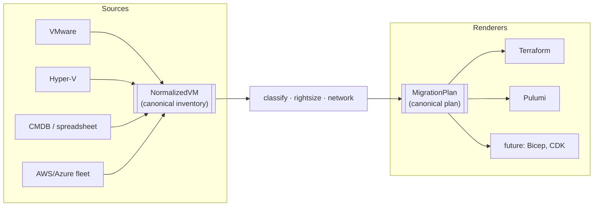
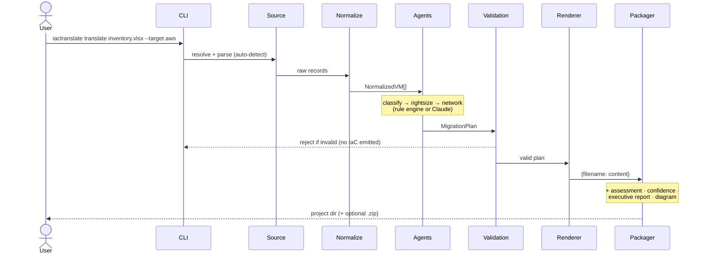
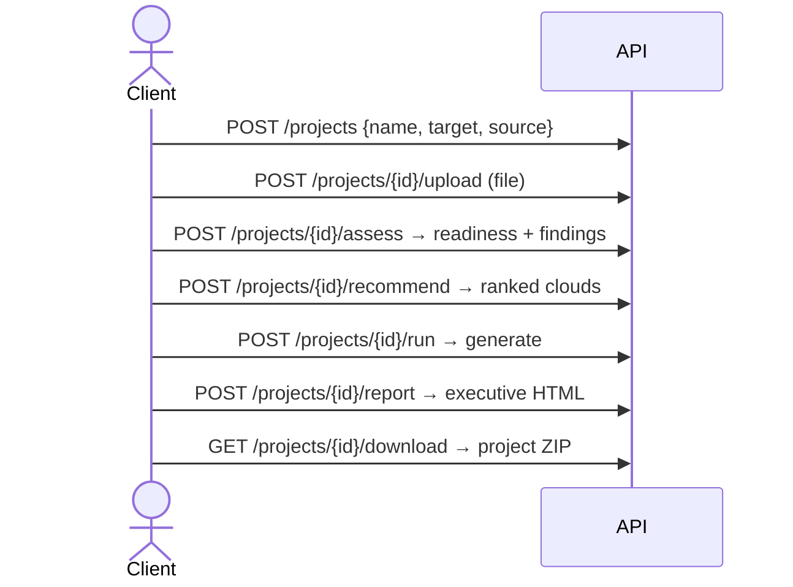

# IaCTranslate — Architecture & Design

Why the system is shaped the way it is. Read this to understand *how to think
about* IaCTranslate; read the [Operations Guide](operations-guide.md) for how to
run and operate it, and the [ADRs](adr/) for the record of individual decisions.

**Contents**
1. [Design principles](#design-principles)
2. [The canonical model (the key idea)](#the-canonical-model)
3. [Request flow (sequence)](#request-flow)
4. [Current scope — what is and isn't supported](#current-scope)
5. [Assumptions](#assumptions)
6. [Why not … (how we differ)](#why-not)

---

## Design principles

These are the invariants every part of the system is held to. When a change
would violate one, that's a signal the change is wrong — not the principle.

1. **Deterministic by default.** The same input always produces the same output.
   No hidden state, no time- or network-dependent results on the default path.
   This is what makes the output auditable and safe to diff in review.

2. **Source agnostic.** Everything *before* `normalize` is source-specific;
   everything *after* it is source-independent. The pipeline never asks whether
   the estate came from VMware, Hyper-V, a CMDB, or a cloud.

3. **Cloud neutral.** The cloud recommendation never favors a provider. Weights
   are explicit and inspectable; no vendor gets a thumb on the scale.

4. **Validation before generation.** An invalid plan never produces IaC. The
   validation layer is a gate, not a warning.

5. **Extensible via registries.** New clouds (targets) and new inventory formats
   (sources) are added behind a protocol — with **no changes to the pipeline**.

6. **Offline first.** The complete pipeline runs with no internet and no API
   keys. Live pricing and AI are opt-in enhancements that degrade gracefully to
   the offline path.

7. **AI is optional.** AI may improve a structured decision (grouping, instance
   choice) but never bypasses validation and never writes Terraform. Turning AI
   off changes quality, never correctness.

---

## The canonical model

The single most important design decision is that **every source collapses to
one representation, and every renderer consumes one representation.** Two narrow
waists, and everything in between is written once.

**`NormalizedVM`** is the canonical *inventory* unit. Every source maps to it;
everything downstream only understands it. The classifier, right-sizer, network
planner, validator, assessment, and confidence engine never learn whether the
source was VMware, ServiceNow, or an Azure export — they read `NormalizedVM`.
Adding a source is therefore a self-contained job: parse the format into
`NormalizedVM`s and register it. Nothing downstream changes.

**`MigrationPlan`** is the canonical *plan*. Every renderer consumes it. Terraform,
Pulumi, and any future renderer (Bicep, CDK) never inspect the original
inventory — they read the validated plan. Adding a renderer is likewise
self-contained: consume `MigrationPlan`, emit files.

This is why "any source → any cloud, any IaC tool" is a small amount of code
rather than an N×M explosion: the pipeline in the middle is written **once**
against the two canonical types.

---

## Request flow

**CLI `translate`** — the deterministic path, no network:

**API** — the same pipeline, one project at a time:

`assess`, `recommend`, and `report` are independent reads over the uploaded
inventory — call them in any order, or not at all. Only `run` produces the
downloadable project.

---

## Current scope

Being explicit about the boundary is part of the contract. IaCTranslate migrates
**server workloads (VMs) and their surrounding network topology** — not the
platform services layered on top.

**Supported**

- ✅ VMware VMs (RVTools `.xlsx`, vSphere CSV)
- ✅ Microsoft Hyper-V (Get-VM export)
- ✅ Generic CMDB / spreadsheet exports (ServiceNow, Device42, Lansweeper, hand-rolled)
- ✅ Existing AWS inventories (re-platform / cross-cloud, with import for brownfield)
- ✅ Existing Azure inventories
- ✅ Targets: AWS, Azure, GCP · Renderers: Terraform, Pulumi

**Not yet supported**

- ✗ Kubernetes / managed Kubernetes (EKS/AKS/GKE) workloads
- ✗ VMware NSX (overlay networking, micro-segmentation)
- ✗ Load balancer migration
- ✗ Database schema / data migration
- ✗ IAM / identity migration
- ✗ Serverless (Lambda/Functions) and PaaS databases (RDS/Cloud SQL/Cosmos)

The network model is deliberately VM-centric: VPC/VNet, subnets, and tier-scoped
security groups. Anything above the VM (service meshes, managed data planes,
identity) is out of scope by design, not by omission.

---

## Assumptions

The generated plan rests on a small set of stated assumptions. Knowing them is
how you read the output critically.

- **One source VM → one cloud VM.** No consolidation or splitting is inferred.
- **Application grouping is inferred from observable metadata** (names, tiers,
  environments), not from real dependency data. Treat groups as a starting point.
- **Public/private topology is derived from workload tiers** (web → public,
  app/db/cache → private), not from the source network layout.
- **Utilization data, when present, is trusted** and drives right-sizing.
- **Missing utilization falls back to allocated resources** (with headroom) — a
  safe over-estimate, flagged by the assessment and the confidence engine.
- **Existing IP addresses are informational only** — cloud subnets get fresh
  CIDRs; source IPs are not reproduced.

---

## Why not …

**Why not `terraform import`?**
`terraform import` adopts resources that *already exist* in the cloud.
IaCTranslate works **before** migration — it produces the IaC for infrastructure
that doesn't exist yet. (For the brownfield case where a fleet *is* already in
the cloud, IaCTranslate *generates* the import blocks for you — see the
[Operations Guide](operations-guide.md).)

**Why not Azure Migrate?**
Azure-only by design; it never emits portable IaC, and a Microsoft tool will
never recommend AWS or GCP. IaCTranslate is cloud-neutral, emits Terraform/Pulumi
you own, and compares all three clouds unbiased.

**Why not AWS Migration Hub / Application Discovery Service?**
AWS-only; no reusable Terraform; cannot compare clouds. Same structural limits as
every first-party vendor tool — the recommendation can only ever point at the
vendor's own cloud.

**Why not just prompt an LLM to write Terraform?**
Non-deterministic, unauditable, and unsafe for production infrastructure. Here the
LLM (optional) makes only *structured* decisions that are re-validated; templates
emit the actual HCL. Same input → same output, every time.
