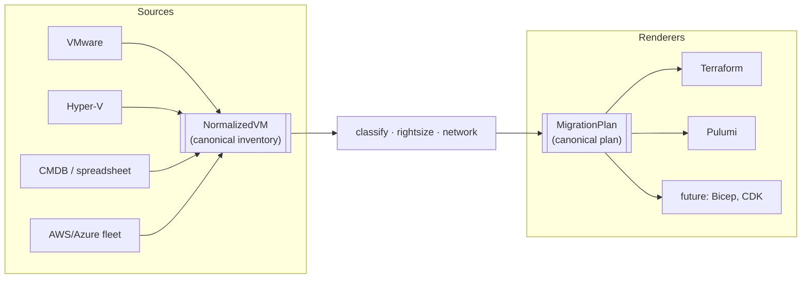
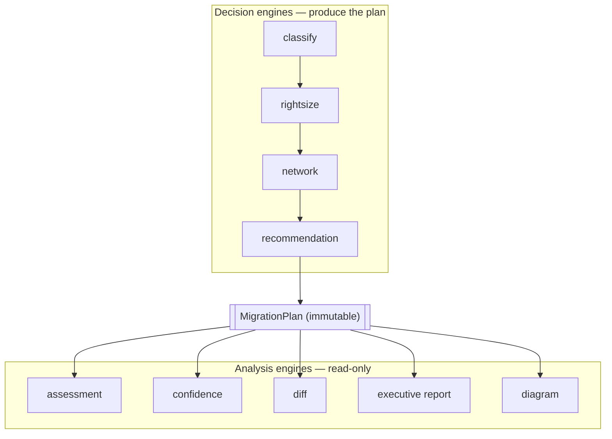
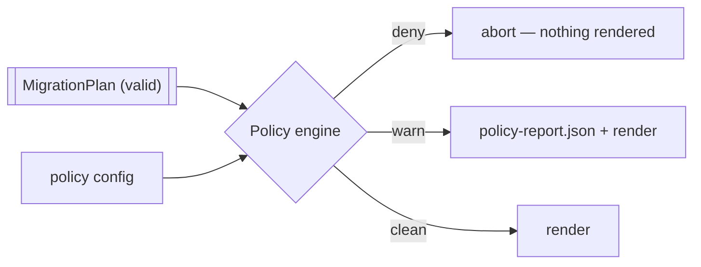
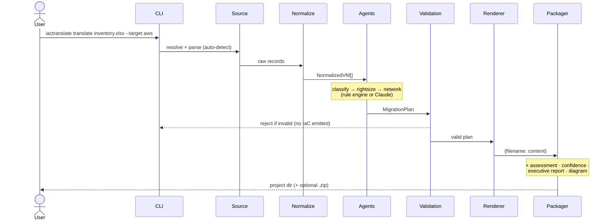
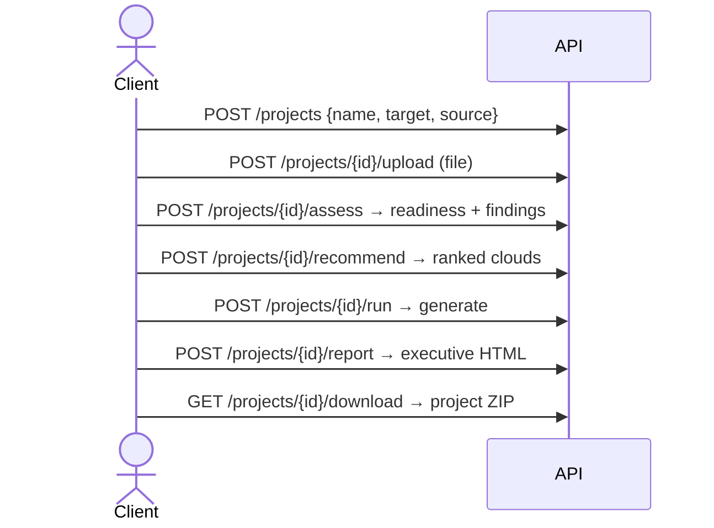

# IaCTranslate — Architecture & Design

Why the system is shaped the way it is. Read this to understand *how to think
about* IaCTranslate; read the [Operations Guide](operations-guide.md) for how to
run and operate it, and the [ADRs](adr/) for the record of individual decisions.

**Contents**
1. [Design principles](#design-principles)
2. [The canonical model (the key idea)](#the-canonical-model)
3. [Pipeline phases](#pipeline-phases)
4. [Decision engines vs analysis engines](#decision-vs-analysis)
5. [The policy engine](#policy-engine)
6. [Target capability flags](#capability-flags)
7. [Request flow (sequence)](#request-flow)
8. [Current scope — what is and isn't supported](#current-scope)
9. [Assumptions](#assumptions)
10. [Why not … (how we differ)](#why-not)

---

## Design principles

These are the invariants every part of the system is held to. When a change
would violate one, that's a signal the change is wrong — not the principle.

1. **Deterministic by default.** The same input always produces the same output.
   No hidden state, no time- or network-dependent results on the default path.
   This is what makes the output auditable and safe to diff in review.

2. **Source agnostic.** Everything *before* `normalize` is source-specific;
   everything *after* it is source-independent. The pipeline never asks whether
   the estate came from VMware, Hyper-V, a CMDB, or a cloud.

3. **Cloud neutral.** The cloud recommendation never favors a provider. Weights
   are explicit and inspectable; no vendor gets a thumb on the scale.

4. **Validation before generation.** An invalid plan never produces IaC. The
   validation layer is a gate, not a warning.

5. **Extensible via registries.** New clouds (targets) and new inventory formats
   (sources) are added behind a protocol — with **no changes to the pipeline**.

6. **Offline first.** The complete pipeline runs with no internet and no API
   keys. Live pricing and AI are opt-in enhancements that degrade gracefully to
   the offline path.

7. **AI is optional.** AI may improve a structured decision (grouping, instance
   choice) but never bypasses validation and never writes Terraform. Turning AI
   off changes quality, never correctness. It's reachable per-invocation from
   the CLI, the API, and the web UI (`--provider`/`provider`/a toggle, not just
   an environment variable), and `MigrationPlan.provider_used` always records
   which engine actually ran — a request for AI that silently fell back to the
   rule engine is never reported as AI having run (see
   [ADR 0021](adr/0021-ai-integration-reachable-and-honest.md)). The executive
   report's summary paragraph is AI-written under the same condition and
   clearly labeled either way.

---

## The canonical model

The single most important design decision is that **every source collapses to
one representation, and every renderer consumes one representation.** Two narrow
waists, and everything in between is written once.



**`NormalizedVM`** is the canonical *inventory* unit. Every source maps to it;
everything downstream only understands it. The classifier, right-sizer, network
planner, validator, assessment, and confidence engine never learn whether the
source was VMware, ServiceNow, or an Azure export — they read `NormalizedVM`.
Adding a source is therefore a self-contained job: parse the format into
`NormalizedVM`s and register it. Nothing downstream changes.

**`MigrationPlan`** is the canonical *plan*. Every renderer consumes it. Terraform,
Pulumi, and any future renderer (Bicep, CDK) never inspect the original
inventory — they read the validated plan. Adding a renderer is likewise
self-contained: consume `MigrationPlan`, emit files.

This is why "any source → any cloud, any IaC tool" is a small amount of code
rather than an N×M explosion: the pipeline in the middle is written **once**
against the two canonical types.

**The Infrastructure Graph.** Between the plan and the renderers sits a third
artifact: a renderer-neutral **topology IR** (`graph.build_graph`) — typed
nodes (VPC, subnet, security group, instance) and edges (`contains`,
`placed_in`, `secured_by`) derived from the plan and shipped as `graph.json`.
The architecture diagram, CloudFormation, Bicep, and CDK all render *from this
graph*. Terraform and Pulumi still render their resources from the plan, but
get subnet placement from the graph too (`graph.assign_subnets`) — one
placement decision every renderer shares, not six independent ones — see
[ADR 0010](adr/0010-infrastructure-graph.md) and
[ADR 0016](adr/0016-terraform-pulumi-placement-from-graph.md).

---

## Pipeline phases

Read left-to-right the pipeline is one line; but internally it is four phases
with different responsibilities. Naming them is how enterprise migration
platforms are usually described, and it clarifies what may touch what.

```
Discovery                Planning              Validation            Rendering
─────────                ────────              ──────────            ─────────
parse                    classify              validate (structure)  Terraform
normalize                rightsize             policy (org rules)    Pulumi
assessment*              network               cost/budget (policy)  reports*
recommendation*          → MigrationPlan       ─────────────         diagram*
diff*                    confidence*           (all read-only)       package · GitOps
```

*Starred stages are **analysis** — they read, never write, the plan (next section).*

- **Discovery** turns raw inventory into `NormalizedVM`s and *understands* the
  estate (assessment, recommendation, diff).
- **Planning** makes the structured decisions and freezes them into a
  `MigrationPlan`.
- **Validation** is a set of read-only gates (structural validation, then the
  policy engine); a failure here stops the run before any file is written.
- **Rendering** turns the validated plan into IaC, docs, and a package.

## Decision vs analysis

Two kinds of engine operate around the plan, and keeping them distinct is what
keeps the architecture clean:



**Decision engines** build the plan. **Analysis engines** (assessment,
confidence, diff, executive report, diagram) only *read* it — they never mutate
it. This is the enforced counterpart of design principle #1: because nothing
after planning can change the plan, rendering is deterministic and every report
describes exactly what gets deployed.

**The immutable-plan contract.** Once `build_migration_plan` returns and
validation passes, the `MigrationPlan` is treated as frozen. Assessment,
confidence, the policy engine, renderers, reports, and GitOps all take it as
read-only input. (See [ADR 0007](adr/0007-immutable-plan.md).)

**Explainability.** Every compute decision carries a human-readable `reason`
captured *at the moment it's made* (e.g. "right-sized from observed utilization:
16 vCPU / 64 GiB at 15% CPU → t3.xlarge; database tier"). The package's
`decisions.json` joins each decision's reason with its confidence — so a
reviewer gets both *why* an instance was chosen and *how sure* the tool is,
per workload.

## Policy engine

Enterprise requirements diverge exactly at policy: naming conventions, approved
instance families, "no public IPs", budget caps, mandatory NAT. Encoding those
in the core pipeline would make it an organization-specific fork. Instead they
live in a **policy engine** — a set of pluggable, read-only rules a customer
activates and parameterizes through configuration.



- Policies **read** the plan and return violations; they never mutate it (so the
  immutable-plan contract and determinism hold).
- `deny` violations abort the run before rendering; `warn` violations are
  reported (`policy-report.json`) but don't block. Any policy's severity is
  overridable per config.
- Built-ins today: `no_public_subnets`, `allowed_instance_families`, `max_vcpu`,
  `max_monthly_cost`, `naming_prefix`, `require_nat`. Adding one is a small
  registered function — no pipeline change. (See [ADR 0008](adr/0008-policy-engine.md).)

```jsonc
// example policy config
{ "no_public_subnets": {}, "allowed_instance_families": {"families": ["t3","m5"]},
  "max_monthly_cost": {"budget_usd": 5000}, "naming_prefix": {"prefix": "acme_", "severity": "warn"} }
```

## Capability flags

A `Target` advertises what it supports as a set of **capability flags**
(`terraform`, `pulumi`, `gitops`, `live_pricing`, `brownfield_import`) rather
than callers branching on `target.name == "aws"`. A UI can enable features
declaratively (`GET /targets` returns each cloud's capabilities), and adding a
capability to a cloud is a one-line change. (See [ADR 0009](adr/0009-capability-flags.md).)

## Request flow

**CLI `translate`** — the deterministic path, no network:



**API** — the same pipeline, one project at a time:



`assess`, `recommend`, and `report` are independent reads over the uploaded
inventory — call them in any order, or not at all. Only `run` produces the
downloadable project.

---

## Current scope

Being explicit about the boundary is part of the contract. IaCTranslate migrates
**server workloads (VMs) and their surrounding network topology** — not the
platform services layered on top.

**Supported**

- ✅ VMware VMs (RVTools `.xlsx`, vSphere CSV)
- ✅ Microsoft Hyper-V (Get-VM export)
- ✅ Kubernetes workloads (`kubectl get … -o json` — containers sized from resource requests)
- ✅ Generic CMDB / spreadsheet exports (ServiceNow, Device42, Lansweeper, hand-rolled)
- ✅ Existing AWS inventories (re-platform / cross-cloud, with import for brownfield)
- ✅ Existing Azure inventories
- ✅ Targets: AWS, Azure, GCP, OCI, DigitalOcean · Renderers: Terraform (all 5),
  Pulumi (AWS/Azure/GCP), CloudFormation, Bicep, AWS CDK, Kubernetes/KubeVirt
- ✅ Load balancer topology (multi-instance tiers front behind an ALB /
  Standard LB / Network LB / OCI flexible LB / DigitalOcean LB, per cloud)
- ✅ Managed-DB re-platforming **advice** (database tiers flagged as RDS / Cloud
  SQL / Azure SQL candidates — advisory, does not change the plan)

**Not yet supported**

- ✗ VMware NSX (overlay networking, micro-segmentation)
- ✗ Database schema / data migration (re-platforming advice above is advisory only)
- ✗ IAM / identity migration
- ✗ Serverless (Lambda/Functions) and PaaS databases as *migration targets*

The network model is deliberately VM-centric: VPC/VNet, subnets, tier-scoped
security groups, and — where a tier has more than one instance — a load
balancer fronting it. Anything above the VM (service meshes, managed data
planes, identity) is out of scope by design, not by omission.

---

## Assumptions

The generated plan rests on a small set of stated assumptions. Knowing them is
how you read the output critically.

- **One source VM → one cloud VM.** No consolidation or splitting is inferred.
- **Application grouping is inferred from observable metadata** (names, tiers,
  environments), not from real dependency data. Treat groups as a starting point.
- **Public/private topology is derived from workload tiers** (web → public,
  app/db/cache → private), not from the source network layout.
- **Utilization data, when present, is trusted** and drives right-sizing.
- **Missing utilization falls back to allocated resources** (with headroom) — a
  safe over-estimate, flagged by the assessment and the confidence engine.
- **Existing IP addresses are informational only** — cloud subnets get fresh
  CIDRs; source IPs are not reproduced.

---

## Why not …

**Why not `terraform import`?**
`terraform import` adopts resources that *already exist* in the cloud.
IaCTranslate works **before** migration — it produces the IaC for infrastructure
that doesn't exist yet. (For the brownfield case where a fleet *is* already in
the cloud, IaCTranslate *generates* the import blocks for you — see the
[Operations Guide](operations-guide.md).)

**Why not Azure Migrate?**
Azure-only by design; it never emits portable IaC, and a Microsoft tool will
never recommend AWS or GCP. IaCTranslate is cloud-neutral, emits Terraform/Pulumi
you own, and compares all three clouds unbiased.

**Why not AWS Migration Hub / Application Discovery Service?**
AWS-only; no reusable Terraform; cannot compare clouds. Same structural limits as
every first-party vendor tool — the recommendation can only ever point at the
vendor's own cloud.

**Why not just prompt an LLM to write Terraform?**
Non-deterministic, unauditable, and unsafe for production infrastructure. Here the
LLM (optional) makes only *structured* decisions that are re-validated; templates
emit the actual HCL. Same input → same output, every time.
