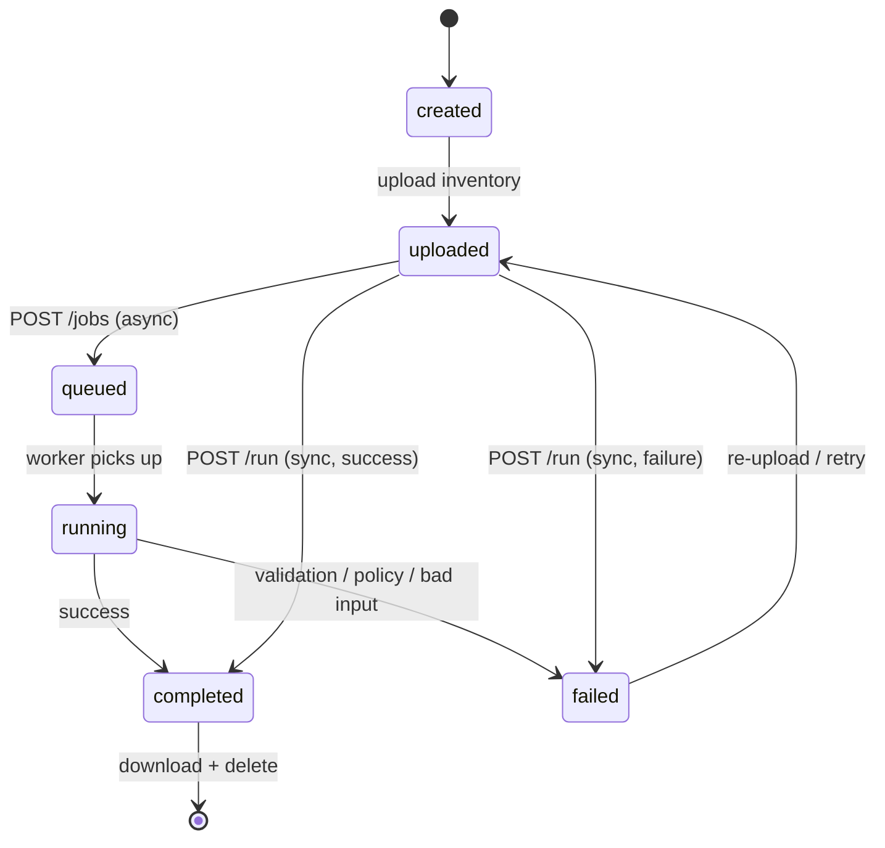
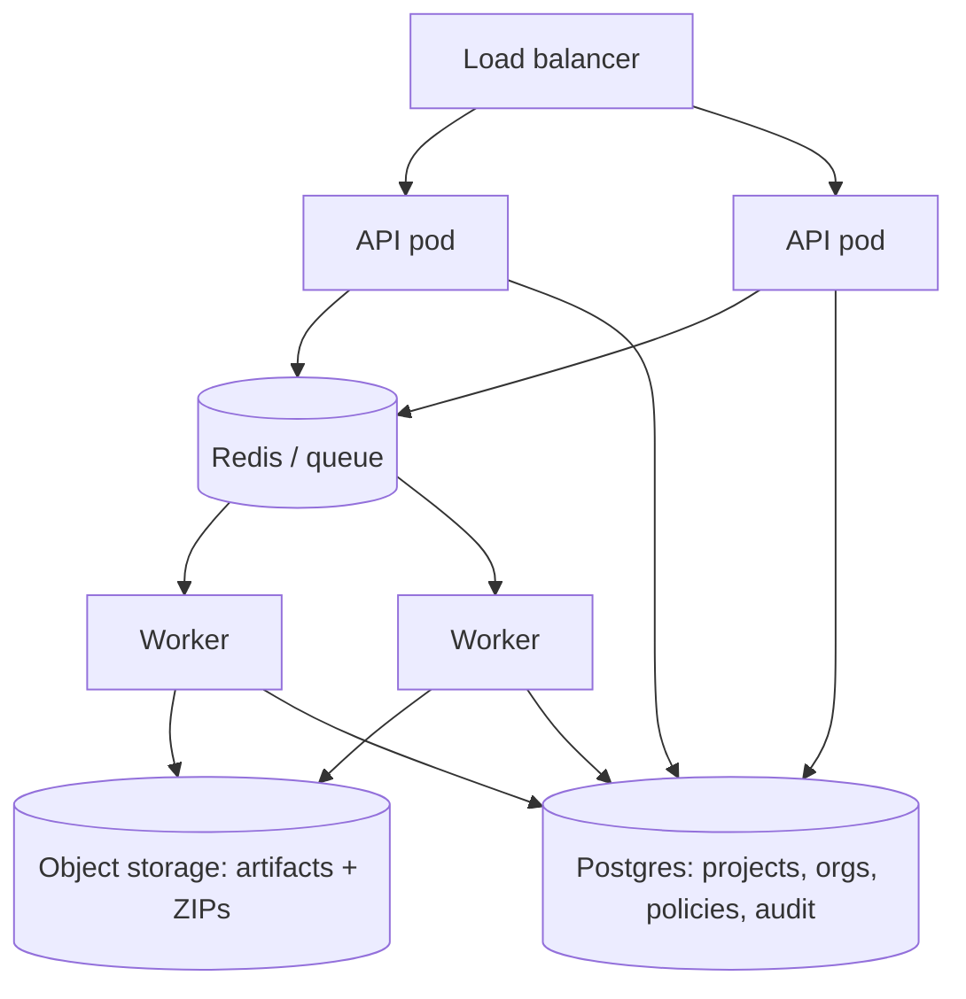

# IaCTranslate — Deployment & Execution

Two things live here: **how a run actually executes today** (the execution model,
which is real and shipped), and a **reference architecture** for running
IaCTranslate at organization scale (which is a target, not yet built — labeled as
such so nobody mistakes the diagram for the current system).

**Contents**
1. [Execution model (shipped)](#execution-model)
2. [Pipeline stages & trace (shipped)](#pipeline-stages)
3. [Project state machine (shipped)](#state-machine)
4. [Single-node deployment (shipped)](#single-node)
5. [Reference architecture for scale (not yet built)](#reference-architecture)
6. [Multi-tenant model (not yet built)](#multi-tenant)

---

## Execution model

What happens for one `POST /projects/{id}/run` (or one CLI `translate`):

```
Request
  ↓  a per-project temporary workspace is created (tempfile dir)
Pipeline  (parse → normalize → plan → validate → policy → package [→ zip])
  ↓  artifacts written into the workspace
Artifacts  (Terraform/Pulumi + reports + graph.json + trace)
  ↓  zipped on download
Response
  ↓  workspace evicted + deleted when the store exceeds its capacity cap
Cleanup
```

Bounds that make this safe on untrusted input (all env-overridable — see the
[Operations Guide §8](operations-guide.md#8-configuration-reference)):

- **Temporary workspace** per project (`tempfile.mkdtemp`), never a shared dir.
- **Memory/CPU** bounded by `IACTRANSLATE_MAX_VMS` (inventory size cap) and the
  25 MB streamed upload cap.
- **Store capacity** `IACTRANSLATE_MAX_PROJECTS`; oldest projects (and their temp
  dirs) are evicted and deleted beyond it.
- **No timeouts/retries needed today** — the pipeline is a synchronous, sub-second
  function (see [performance](operations-guide.md#14-performance)); timeouts and
  retries belong to the async reference architecture below.

## Pipeline stages

The pipeline runs as an ordered list of **named, timed stages**; each run emits a
`pipeline-trace.json` and a structured log line:

| Stage | Does |
|---|---|
| `parse` | source-specific → raw records |
| `normalize` | raw records → `NormalizedVM[]` |
| `plan` | classify · rightsize · network → `MigrationPlan` |
| `validate` | structural gate (catalog, CIDR, refs) |
| `policy` | organization rules (deny aborts, warn reports) |
| `package` | render + reports + graph + diagram |
| `zip` | archive (optional) |

```jsonc
// pipeline-trace.json
{ "total_ms": 38.4, "stages": [
    {"stage":"parse","duration_ms":9.0}, {"stage":"normalize","duration_ms":1.1},
    {"stage":"plan","duration_ms":1.4}, {"stage":"validate","duration_ms":0.1},
    {"stage":"policy","duration_ms":0.02}, {"stage":"package","duration_ms":26.7} ] }
```

This is the observability substrate. **Resumable / distributed** execution
(persist state after each stage, resume from the failed one, run stages on
workers) would build on this stage model — it needs the persistence + queue from
the reference architecture and is tracked in the [roadmap](roadmap.md), not yet
implemented.

## State machine

A project moves through explicit states (visible in the API and the web UI). The
**async** path (`POST /jobs`) adds `queued` → `running`; the **sync** path
(`POST /run`) goes straight to `completed`/`failed`:



The transitions are enforced by the API (`Project.status`); only a run/job
produces a downloadable project.

### Async jobs, events & audit (shipped, single-node)

The runtime layer is event-driven and job-based *today* — the interfaces the
production backends drop into:

- **Event bus** (`api/events.py`) — lifecycle events (`project.*`, `job.*`)
  published in-process; swap for Redis/Kafka without touching publishers.
- **Job queue** (`api/jobs.py`) — `POST /projects/{id}/jobs` → `job_id`; the
  pipeline runs on a worker thread; poll `GET /jobs/{id}`. Swap the
  `ThreadPoolExecutor` for Celery/Dramatiq + Redis behind the same contract.
- **Audit trail** (`api/audit.py`) — every action recorded via the bus; query
  `GET /audit`. In-memory now; the same subscriber writes Postgres in production.

**Not yet durable:** in-memory jobs/audit don't survive a restart — that comes
with the persistent backend below. See [ADR 0012](adr/0012-async-jobs-event-bus-audit.md).

## Single-node

The shipped deployment is a single container:

```
Docker (non-root, healthchecked /health)
  └─ uvicorn  →  FastAPI  →  in-memory ProjectStore + per-project temp workspaces
```

```bash
docker build -t iactranslate .
docker run -p 8000:8000 iactranslate
```

Good for a team, a demo, or CI. State is in-memory and workspaces are
temporary — restart loses projects (by design at this tier).

## Reference architecture

> **Not yet built.** This is the target topology for multi-user, large-estate
> operation — what the current single-node design would grow into. It is included
> so the docs answer "how would this run for 500 users?", not to imply it exists.



- **API pods** stay stateless (they already are — no session state); horizontal
  scaling is adding pods behind the LB.
- **Queue + workers** run the pipeline asynchronously so long jobs and very large
  estates don't block request threads. Each stage checkpoints to Postgres →
  resumable runs.
- **Postgres** replaces the in-memory `ProjectStore` (the store interface is the
  seam) and holds orgs/projects/policies/audit.
- **Object storage** is the durable **artifact store** for every produced file
  (`graph.json`, Terraform/Pulumi, reports, ZIPs) — reproducible and retained.

What already lines up for this: the API is stateless; the `ProjectStore` is a
single swappable interface; the pipeline is stage-structured with a trace; every
output is a file. The gap is persistence + a queue — deliberately deferred until
there's a multi-user driver (see [roadmap](roadmap.md)).

## Multi-tenant

> **Not yet built.** The data model for SaaS multi-tenancy:

```
Organization
  ├─ Users            (authn/authz — not yet implemented)
  ├─ Projects         (exists today, in-memory)
  ├─ Policies         (policy engine exists; per-org scoping is the addition)
  ├─ Artifacts        (per-run outputs → object storage)
  └─ Audit            (per-action log → Postgres)
```

Authentication, per-org isolation, and audit are the work here; the policy engine
and artifact set already exist and would be scoped per organization.
